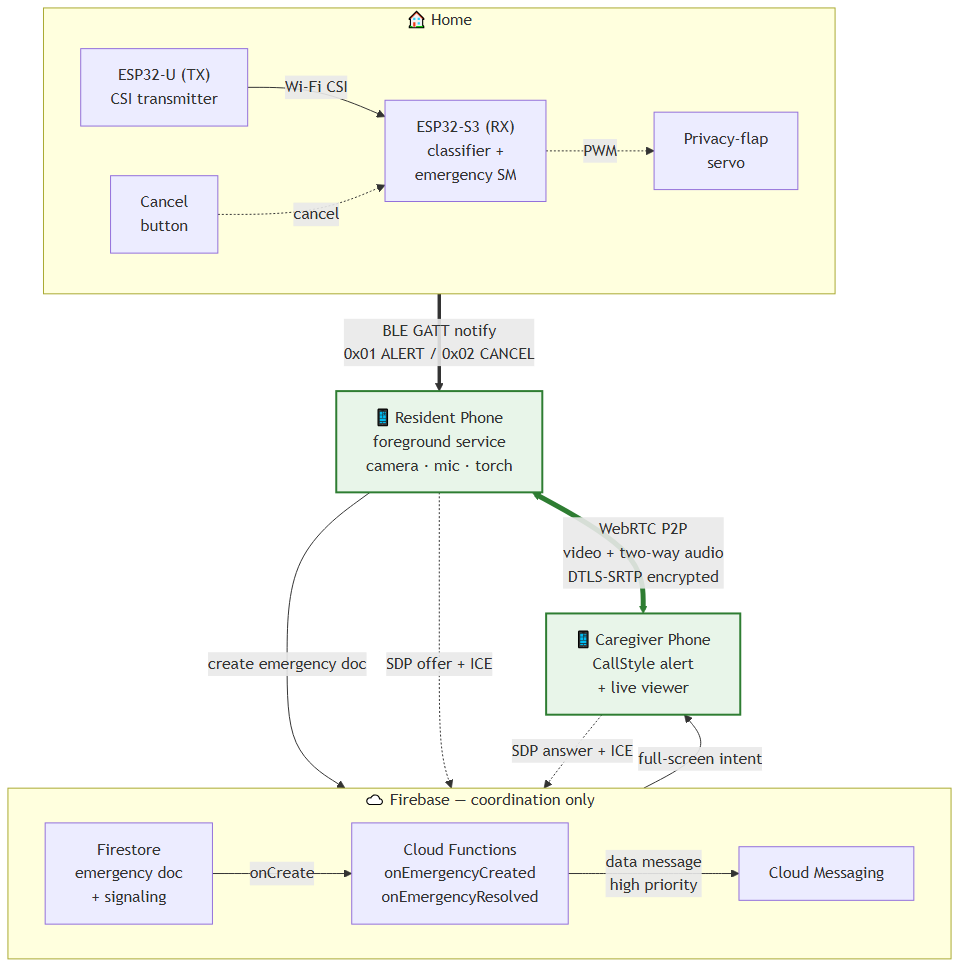
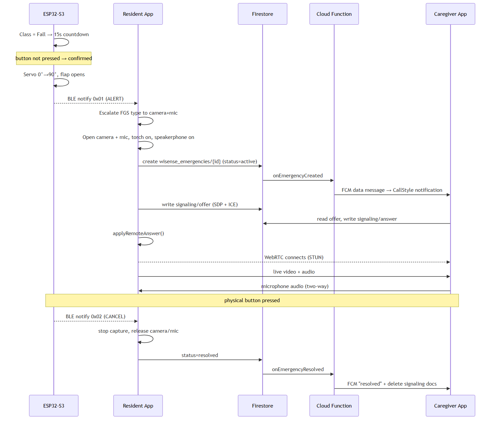
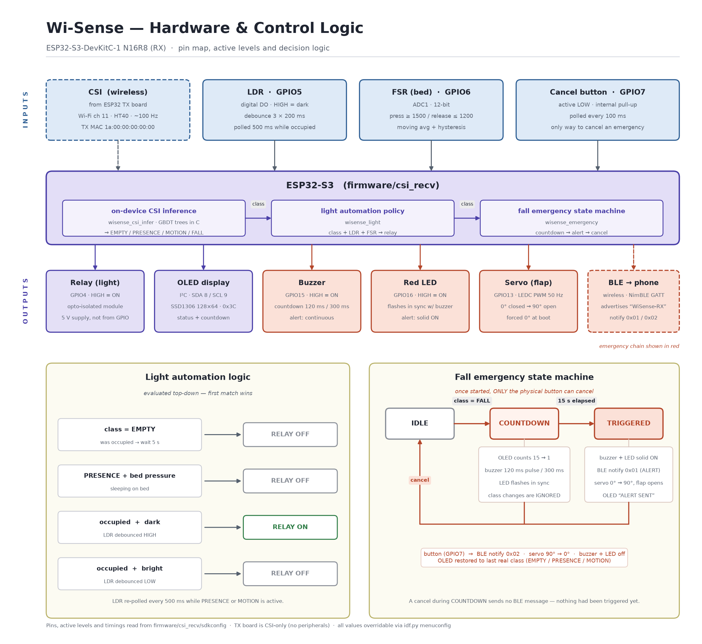

# Wi-Sense

Privacy-preserving fall detection for a bedroom or care room. Wi-Sense watches for a fall using Wi-Fi signal disturbance (CSI — Channel State Information), **not a camera**. A phone's camera and microphone only turn on for the seconds that actually matter: after a fall is confirmed and a caregiver needs to see what's happening.

## Why CSI instead of a camera

A camera watching someone 24/7, even a family member, is a privacy trade nobody should have to make just to be safe. Wi-Fi CSI senses body motion through how it disturbs the radio signal already in the room — no image is ever formed. The only camera in the system is on the resident's own phone, and it only activates after:

1. An on-device model classifies a fall from CSI, and
2. A 15-second countdown expires with the physical cancel button **not** pressed.

That countdown is a deliberate, physical human-confirmation step — the system does not silently start streaming.

## System overview



Two ESP32 boards per room:

| Board | Role |
|---|---|
| **TX** — plain ESP32 | Sends CSI-triggering traffic over ESP-NOW at 100 Hz. Does nothing else. |
| **RX** — ESP32-S3-DevKitC-1 (N16R8) | Receives CSI, runs the on-device classifier, and owns every peripheral: OLED status display, relay-controlled room light, bed-pressure sensor, the fall-emergency state machine, and a BLE link to the resident's phone. |

When the RX confirms a fall, it notifies the resident's phone over Bluetooth Low Energy. The phone escalates to a foreground service, opens its camera/mic, and streams peer-to-peer to a caregiver's phone over WebRTC — Firebase is only ever used for auth, push notification, and WebRTC signaling, **never for video**.



| Hop | Technology | Notes |
|---|---|---|
| TX → RX | Wi-Fi CSI over ESP-NOW | Channel 11, HT40, fixed TX MAC `1a:00:00:00:00:00` |
| RX → Resident phone | BLE GATT notify (NimBLE) | 1-byte value, notify-only — no write path the ESP32 accepts |
| Resident phone (background) | Android foreground service | Escalates to `camera｜microphone` on alert |
| Emergency record | Firestore | Read access scoped by house/caregiver membership |
| Notification | Cloud Functions → FCM | Data message, so the app controls presentation (full-screen alert) |
| Media | WebRTC, P2P | DTLS-SRTP encrypted; STUN for NAT traversal |

## Repository layout

```
firmware/
├── csi_send/                # TX — plain ESP32, CSI-only
├── csi_recv/                # RX — ESP32-S3, production firmware (all peripherals + inference)
├── csi_recv_router/         # Example variant: CSI via router ping instead of a TX board
├── wisense_hw/               # RX peripheral stack on a cheap ESP32 DevKit, for bench iteration
└── components/wisense_*/     # Shared components: OLED, relay/light, FSR, emergency SM,
                               # servo, BLE trigger, on-device CSI inference

python/
├── capture/, collect/        # CSI dataset capture over serial
├── preprocess/                # Windowing, baselining, feature extraction
├── train/, eval/              # Model training and evaluation
├── export/                    # Compile a trained model to C for on-device inference
├── live/                      # PC-side live classification (reference / debugging)
└── legacy/                    # Original ASCII CSI viewer

mobile/
├── resident-app/              # BLE client, camera/mic capture, WebRTC caller
├── caregiver-app/             # Push notifications, WebRTC viewer
└── shared/                    # ble-protocol, webrtc-core — used by both apps

backend/functions/            # Firebase Cloud Functions (notification, cleanup)
docs/images/                  # Architecture and hardware diagrams
data/, models/                # Local datasets and trained models (gitignored)
```

## Hardware



### RX pinout (production — `firmware/csi_recv`, ESP32-S3-DevKitC-1 N16R8)

| Function | GPIO | Notes |
|---|---|---|
| OLED SDA / SCL | 8 / 9 | SSD1306 128x64, I2C address `0x3C` |
| Relay (room light) | 4 | HIGH = light ON |
| LDR (light sensor) | 5 | HIGH = dark, debounced |
| FSR (bed pressure) | 6 | ADC1, hysteresis at raw thresholds 1500 (press) / 1200 (release) |
| Cancel button | 7 | Active LOW, internal pull-up |
| Buzzer | 15 | Fast beeps during countdown, continuous after alert |
| Emergency LED | 16 | Flashes with buzzer, solid after alert |
| Servo (privacy flap) | 13 | 0°=closed (boot default), 90°=open on alert |

GPIO 26-37 are reserved for octal flash/PSRAM on this exact module and must not be reused. `firmware/wisense_hw` targets a plain ESP32 DevKit instead and uses a different pin set (component `Kconfig` defaults) — check its `sdkconfig.defaults` before wiring a breadboard rig.

### Build and flash

Requires ESP-IDF 5.5.x.

```bash
# TX — CSI transmitter
cd firmware/csi_send
idf.py set-target esp32
idf.py -p <PORT> flash monitor

# RX — production firmware (ESP32-S3-DevKitC-1)
cd firmware/csi_recv
idf.py set-target esp32s3
idf.py -p <PORT> flash monitor
```

`firmware/wisense_hw` builds the same peripheral stack (OLED, light, FSR, emergency SM) alone on a plain ESP32 DevKit, for bench-testing hardware logic without the CSI radio work — same flash/monitor flow, `idf.py set-target esp32`.

### Fall-emergency behavior

- A `Fall` classification starts a 15-second OLED countdown with fast buzzer/LED pulses.
- Pressing the cancel button at any point during the countdown, or after alert, returns everything to normal — no notification is ever sent for a cancelled countdown.
- If the countdown expires unresolved: the servo opens the privacy flap, the buzzer/LED go solid, and the RX sends a BLE `ALERT` notification.
- Pressing cancel after alert closes the flap and sends a BLE `CANCEL` notification.

## On-device inference

The RX classifies room state (Empty / Presence / Motion / Fall) directly on the ESP32-S3 — no PC in the loop at runtime. The trained model is three gradient-boosted tree ensembles (`HistGradientBoostingClassifier`), which have no TFLite Micro operator support, so instead of quantizing to a neural net, the trees are compiled straight to C lookup tables:

- Exact match to the Python model — measured max probability delta `6.8e-9`, zero decision flips across 400 validation windows.
- No interpreter, no heap allocation, inference in microseconds.
- 15,474 tree nodes ≈ 181 KB of `.rodata`; app image is 1.19 MB inside a 4 MB partition.
- A boot self-test scores known-good vectors against the Python pipeline's own output and logs PASS/FAIL, catching any drift between the exporter and the firmware.

Fall detection defaults to a **heuristic rule** (motion burst followed by sudden stillness) rather than the trained fall stage — the fall model currently scores held-out falls at only 0.55 mean probability, trained on too few real fall recordings to generalize. `WISENSE_CSI_FALL_MODE` in `menuconfig` can select the trained stage or disable fall reporting entirely.

After retraining a model, regenerate and re-verify the on-device copy:

```bash
python python/export/export_cascade_c.py
python python/export/check_c_parity.py
```

## CSI data pipeline (PC-side)

Used for collecting training data and for reference/debugging live classification off-device.

```bash
python -m venv venv
# Windows: venv\Scripts\activate   Linux/macOS: source venv/bin/activate
pip install -r requirements.txt
export PYTHONPATH=./python   # Windows: set PYTHONPATH=python
```

```bash
# Capture raw CSI to CSV
python python/capture/capture_csi_binary.py -p COM4 -s data/raw/empty_fan_on/test.csv --duration 60

# Guided dataset collection
python python/collect/collect_empty_room.py --fan-on
python python/collect/collect_presence_session.py
python python/collect/collect_motion_session.py
python python/collect/collect_fall_session.py

# Preprocess into train/val windows
python python/preprocess/preprocess_csi.py --dataset-root data/dataset --output-dir data/dataset/processed

# Train
python python/train/train_cascade.py --train data/dataset/processed/train.npz --val data/dataset/processed/val.npz

# Reference live classification from a laptop (RX must stream binary CSI, see below)
python python/live/live_cascade_detect.py -p COM4
```

The on-device classifier and the binary CSI stream share one USB port on the RX board — set `CONFIG_WISENSE_CSI_STREAM_BINARY=y` before capturing datasets or running `live_cascade_detect.py`; it defaults to off so the on-device classifier's own log output stays readable.

Raw captures (`data/raw/`, `data/dataset/`) and trained model artifacts (`models/`) are gitignored — regenerate them locally rather than committing.

## BLE protocol (RX → resident phone)

| Field | Value |
|---|---|
| Advertised name | `WiSense-RX` |
| Service UUID | `f19e0100-6a2c-418d-9e4a-2f5bc3e09a01` |
| Characteristic UUID | `f19e0200-6a2c-418d-9e4a-2f5bc3e09a01` |
| Properties | `READ` + `NOTIFY` — no write path the phone can use |
| `0x00` | Idle |
| `0x01` | **ALERT** — fall confirmed, camera/mic/stream should start |
| `0x02` | **CANCEL** — button pressed after alert, camera/mic/stream should stop |

A cancel *during* the 15-second countdown sends nothing — only a confirmed alert or a post-alert cancel produces BLE traffic.

## Mobile apps

Two Android apps sharing common modules under `mobile/shared/`:

| App | Responsibility |
|---|---|
| `resident-app` | Connects to the RX over BLE, escalates to a foreground service on alert, captures camera/mic, and is the WebRTC caller |
| `caregiver-app` | Receives push notifications, is the WebRTC viewer, shows emergency history |
| `shared/ble-protocol` | UUIDs and message parsing from the table above |
| `shared/webrtc-core` | Peer connection setup, Firestore-based signaling |

Stack: Jetpack Compose, MVVM + light Clean Architecture, Hilt, CameraX, `io.getstream:stream-webrtc-android`, Firebase Auth/Firestore/FCM.

### Setup

Each app needs a `google-services.json` from your own Firebase project (not committed — see `google-services.json.example` in each app folder for the expected shape):

```bash
cp mobile/resident-app/google-services.json.example mobile/resident-app/google-services.json
cp mobile/caregiver-app/google-services.json.example mobile/caregiver-app/google-services.json
# then fill in real values from the Firebase console
```

```bash
cd mobile
./gradlew :resident-app:assembleDebug
./gradlew :caregiver-app:assembleDebug
```

## Backend (Firebase)

```
houses/{houseId}                          # ownerId, caregiverIds[], residentDeviceBleId
houses/{houseId}/caregivers/{userId}
emergencies/{emergencyId}                 # status, triggeredAt/resolvedAt, triggerSource
emergencies/{emergencyId}/signaling/{offer|answer}   # short-lived WebRTC signaling
```

Cloud Functions (`backend/functions`): dispatch FCM on emergency create/resolve, prune stale FCM tokens, clean up signaling documents once a call ends.

```bash
cd backend
firebase deploy --only firestore:rules,firestore:indexes,functions
```

## Known limitations

- **STUN only, no TURN** — P2P WebRTC works reliably on shared Wi-Fi and Wi-Fi↔mobile-data, but can fail mobile-data↔mobile-data behind carrier-grade NAT.
- **Single caregiver signaling slot** — with multiple caregivers, whichever app negotiates first gets the stream.
- **Fall model is weak** — the on-device classifier defaults to a motion-then-stillness heuristic rather than the trained fall stage; a larger, more varied fall dataset is the real fix.
