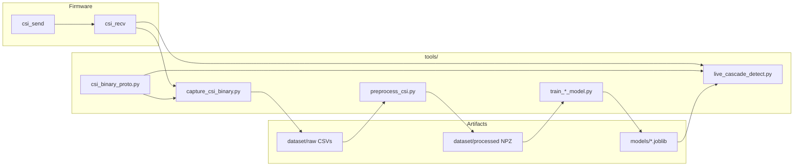

# WiFi CSI Presence / Motion / Fall Detection — Project Handoff

Handoff document for the ESP32 CSI sensing pipeline built on top of Espressif's `esp-csi` get-started examples. Covers hardware, firmware, data collection, training, live inference, known issues, and recommended next steps.

**Primary ops guide:** [LIVE_DETECTION.md](./LIVE_DETECTION.md)  
**Project root:** [../README.md](../README.md)

> **Note:** The repo was reorganized (Jul 2026). Python code lives under `python/`; raw data under `data/raw/`; firmware under `firmware/`. Train/eval/live scripts were removed — retrain from scratch in `python/train/`, `python/eval/`, `python/live/`.

---

## 1. Executive summary

This project detects room state from WiFi Channel State Information (CSI):

| State | Meaning |
|-------|---------|
| `EMPTY` | Room unoccupied (fan may be on) |
| `PRESENCE` | Person present, relatively still |
| `MOTION` | Active movement |
| `FALL` | Fall-like event (experimental, weak) |

**Architecture:** ESP32-CAM sends ESP-NOW packets → ESP32-S3 receives CSI → binary frames over USB @ 921600 → laptop runs a 3-stage sklearn cascade (empty → motion → fall).

**Current status (Jul 2026):**

| Component | Status |
|-----------|--------|
| Presence detection | Working live |
| Motion detection | Working live |
| Empty detection | Fixed in code (cal-over-ML fallback); needs live re-test |
| Fall detection | Enabled via `--enable-fall` but model is weak; scores stay ~0.00 live |
| ML empty model | Baseline drift vs live CSI — retrain recommended |

---

## 2. System architecture

```
ESP32-CAM (csi_send)  --ESP-NOW-->  ESP32-S3 (csi_recv)  --USB 921600-->  Laptop
                                                                              |
                                                                    live_cascade_detect.py
                                                                    (sklearn HGB cascade)
```



### Two parallel stacks in `examples/get-started/`

| Stack | UART format | Python entry | Documentation |
|-------|-------------|--------------|---------------|
| **Original Espressif demo** | ASCII `CSI_DATA,...` lines | `csi_data_read_parse.py` (PyQt5) | `README.md` |
| **ML cascade (this project)** | Binary frames (`0xC511` magic) | `live_cascade_detect.py` | `LIVE_DETECTION.md` |

The ML pipeline requires the **binary** `csi_recv` firmware, not the ASCII-only path.

### Shared binary protocol

C and Python must stay in sync:

| Location | File |
|----------|------|
| Firmware | `../csi_recv/main/csi_binary_proto.h` |
| Python | `csi_binary_proto.py` |

Magic `0xC511`, layouts `LEGACY` (0) and `C5C6` (1), max payload 384 bytes.

---

## 3. Hardware setup

| Role | Board | Firmware |
|------|-------|----------|
| Transmitter | ESP32-CAM | `csi_send` |
| Receiver | ESP32-S3 | `csi_recv` |

**WiFi:** channel 11, HT40, MAC `1a:00:00:00:00:00`  
**Serial:** `/dev/ttyACM0` (typical), 921600 baud  
**Environment:** fan-on empty room is the training baseline; external antennas recommended; boards >1 m apart.

### Flash firmware

```bash
# Transmitter
cd ~/esp-csi/examples/get-started/csi_send
idf.py set-target esp32
idf.py build flash monitor

# Receiver
cd ~/esp-csi/examples/get-started/csi_recv
idf.py set-target esp32s3
idf.py build flash -p /dev/ttyACM0
```

---

## 4. Python environment

```bash
cd ~/esp-csi/examples/get-started/tools
python3 -m venv venv
source venv/bin/activate
pip install -r requirements.txt
```

Key dependencies: `numpy`, `pyserial`, `scikit-learn`, `joblib`, `tensorflow` (optional for `.tflite` export), `PyQt5` (legacy viewer only).

Always use the project venv for training and live detection:

```bash
source venv/bin/activate
# or explicitly:
venv/bin/python3 live_cascade_detect.py --port /dev/ttyACM0 --live
```

---

## 5. Directory layout

```
examples/get-started/
├── README.md / README_cn.md       # Original ASCII demo docs
├── docs/_static/                  # README screenshots
├── csi_send/                      # Transmitter firmware
├── csi_recv/                      # Receiver firmware (+ csi_binary_proto.h)
├── csi_recv_router/               # Alternate router demo (NOT used by ML pipeline)
└── tools/                         # ← ML pipeline lives here
    ├── handoff.md                 # This file
    ├── LIVE_DETECTION.md          # Operational runbook
    ├── requirements.txt
    │
    ├── csi_binary_proto.py        # Binary frame parser (shared with firmware)
    ├── capture_csi_binary.py      # Serial capture → CSV
    ├── csi_data_read_parse.py     # Legacy PyQt5 ASCII viewer
    ├── csi_viewer.html            # Browser Web Serial viewer
    │
    ├── collect_*.py               # Guided data collection
    ├── capture_*.sh               # Shell wrappers for empty capture
    │
    ├── preprocess_csi.py          # CSV → NPZ feature tensors
    ├── train_common.py            # Shared training utilities
    ├── train_{empty,motion,fall}_model.py
    ├── train_all_models.py
    ├── train_models.sh            # Full pipeline entry point
    ├── train_fall_v2.sh           # Fall-only experiment
    ├── train_fall_v2_negs.sh      # Fall + motion hard-negatives
    │
    ├── live_cascade_detect.py     # Live inference (main runtime)
    ├── eval_cascade.py            # Offline val.npz evaluation
    ├── eval_prerecorded.py        # Per-class CSV evaluation
    ├── compare_live_features.py   # Preprocess vs live parity check
    ├── validate_csi_captures.py   # CSV quality audit
    ├── run_replay_test_matrix.py  # Offline state matrix
    ├── ablate_csi_vs_rssi.py      # CSI vs CSI+RSSI ablation
    │
    ├── dataset/                   # Raw captures + processed tensors
    │   ├── empty_fan_on/          # Empty room (fan on) — primary empty class
    │   ├── presence/              # Still person, 10 positions
    │   ├── motion/                # 11 motion activities
    │   ├── fall_v2/               # Fall sessions (center, bed_edge, near_door)
    │   └── processed/             # train.npz, val.npz, manifest, config
    │
    ├── models/                    # Deployed cascade models
    │   ├── empty_occupied.joblib + metrics.json
    │   ├── motion.joblib + metrics.json
    │   ├── fall.joblib + metrics.json
    │   └── fall_v2/               # Fall experiment outputs
    │
    └── venv/                      # Local Python environment (recreate, don't copy)
```

---

## 6. File reference (tools/)

### Protocol and capture

| File | Purpose |
|------|---------|
| `csi_binary_proto.py` | Python struct definitions matching `csi_binary_proto.h` |
| `capture_csi_binary.py` | Read binary UART stream; write CSV + log |
| `csi_data_read_parse.py` | Legacy real-time ASCII CSI PyQt5 plotter |
| `csi_viewer.html` | Browser-based Web Serial CSI viewer |

### Data collection

| File | Purpose |
|------|---------|
| `collect_empty_room.py` | Guided empty-room capture (fan on/off variants) |
| `collect_presence.py` | Still person at room positions |
| `collect_presence_session.py` | Runs all presence scenarios |
| `collect_motion.py` | Motion activities (walk, arm wave, etc.) |
| `collect_motion_session.py` | Runs all motion scenarios |
| `collect_fall.py` | Single fall capture with timed cue |
| `collect_fall_session.py` | Multi-scenario fall session |
| `capture_live_empty.sh` | One-shot 60 s empty capture |
| `capture_live_empty_30min.sh` | Long empty baseline for retraining |
| `capture_empty_retrain.sh` | Batch empty clips + feature parity check |

### Preprocessing and training

| File | Purpose |
|------|---------|
| `preprocess_csi.py` | Window CSI CSVs → feature NPZ (`dataset/processed/`) |
| `train_common.py` | Paths, feature extraction, sklearn predict helpers |
| `train_empty_model.py` | Train empty vs occupied (HGB classifier) |
| `train_motion_model.py` | Train motion vs still on occupied windows |
| `train_fall_model.py` | Train fall vs not-fall |
| `train_all_models.py` | Subprocess runner for all three models |
| `train_models.sh` | **Main entry:** preprocess all classes + train cascade |
| `train_fall_v2.sh` | Preprocess + train fall only → `models/fall_v2/` |
| `train_fall_v2_negs.sh` | Fall training with motion hard-negatives |

### Evaluation and live runtime

| File | Purpose |
|------|---------|
| `live_cascade_detect.py` | **Main live app** — binary CSI → state labels |
| `eval_cascade.py` | Offline evaluation on `val.npz`; threshold sweep |
| `eval_prerecorded.py` | One CSV per class; preprocess + live replay metrics |
| `compare_live_features.py` | Verify live features match preprocess pipeline |
| `validate_csi_captures.py` | Audit CSV packet counts and outliers |
| `run_replay_test_matrix.py` | Offline EMPTY/PRESENCE/MOTION matrix on sample CSVs |
| `ablate_csi_vs_rssi.py` | Compare CSI-only vs CSI+RSSI features |

---

## 7. Dataset structure

| Directory | Label | Contents |
|-----------|-------|----------|
| `dataset/empty_fan_on/` | `empty` | Empty room with fan on (`live_empty_retrain_*.csv`, `s*_empty.csv`) |
| `dataset/presence/` | `presence` | Still person at 10 positions (almirah, bed, center, etc.) |
| `dataset/motion/` | `motion` | 11 activities (walk, arm wave, march, pace, etc.) |
| `dataset/fall_v2/` | `fall` | Falls at center, bed edge, near door (multiple sessions each) |
| `dataset/processed/` | — | `train.npz`, `val.npz`, `preprocess_manifest.csv`, `preprocess_config.json` |

Preprocess config highlights (`preprocess_config.json`):
- 32 subcarriers selected from HT40 guard bands
- Expected MAC: `1a:00:00:00:00:00`
- Window sizes: 1 s (motion/presence), 2 s (fall)
- Feature vector: 75 dimensions

CSVs are gitignored (`.gitignore` ignores `*.csv`, `*.txt` in tools). Back up `dataset/` separately.

---

## 8. Training from scratch

### Full cascade (recommended)

```bash
cd ~/esp-csi/examples/get-started/tools
source venv/bin/activate
./train_models.sh
```

This runs:
1. `preprocess_csi.py --classes empty,presence,motion,fall --empty-source live --fall-dir dataset/fall_v2`
2. `train_all_models.py --backend sklearn --classifier hgb`

Outputs land in `models/`:
- `empty_occupied.joblib` + `empty_occupied_metrics.json`
- `motion.joblib` + `motion_metrics.json`
- `fall.joblib` + `fall_metrics.json`

### Environment overrides

```bash
EMPTY_SOURCE=live \
FALL_DIR=dataset/fall_v2 \
PROCESSED_DIR=dataset/processed \
MODELS_DIR=models \
VAL_RATIO=0.2 \
./train_models.sh
```

### Fall-only experiments

```bash
./train_fall_v2.sh          # → models/fall_v2/
./train_fall_v2_negs.sh     # fall + motion hard-negs → models/fall_v2_negs/
```

### After retraining empty (fix live baseline drift)

```bash
./capture_live_empty.sh /dev/ttyACM0
# or longer baseline:
./capture_live_empty_30min.sh /dev/ttyACM0

python3 preprocess_csi.py --empty-source live --classes empty
python3 train_empty_model.py
```

---

## 9. Model metrics (last train)

| Model | Val F1 | Threshold | Notes |
|-------|--------|-----------|-------|
| Empty/Occupied | 0.997 | 0.05 | Strong offline; drifts on live CSI |
| Motion | 0.960 | 0.575 | Good offline and live |
| Fall | 0.286 | 0.05 (tuned) / 0.58 live floor | Weak; needs more data |

Backend: sklearn `HistGradientBoostingClassifier` on 75-dim feature vectors. `.keras` / `.tflite` exports exist but live runtime uses `.joblib`.

---

## 10. Live detection

### Startup sequence

1. **~20 s** — exit countdown (`>>> EXIT ROOM NOW <<<`)
2. **~15 s** — empty-room calibration (`... calibrating empty room ...`) — stay out
3. **Active** — wait for `[ ] EMPTY` with low `occ` before entering

Total: ~35 s with room empty before testing occupancy.

### Run live

```bash
cd ~/esp-csi/examples/get-started/tools
source venv/bin/activate
python3 live_cascade_detect.py --port /dev/ttyACM0 --live --motion-thr 0.55 --enable-fall
```

### Log line format

```
[ ] EMPTY    | occ=0.06(0.06 cal=0.06 sv=1.00 ss=1.00) mot=0.00 fall=0.00 | t=  2.8s pkts=1533
[.] PRESENCE | occ=0.91(0.91 cal=0.85 sv=0.95 ss=0.93) mot=0.23 fall=0.01 | t=  5.0s pkts=1628
[o] MOTION   | occ=0.88(0.88 cal=0.85 sv=0.90 ss=0.88) mot=0.76 fall=0.02 | t= 16.6s pkts=2026
[!] FALL     | occ=0.93(0.93 cal=0.85 sv=0.90 ss=0.88) mot=0.41 fall=0.65 | t= 39.7s pkts=2917
```

| Field | Meaning |
|-------|---------|
| `occ` | Fused occupancy score (drives EMPTY vs occupied latch) |
| `cal` | Session calibration profile score |
| `sv` | Saved sklearn model score |
| `ss` | Session sklearn model score (if re-fit) |
| `mot` | Motion score |
| `fall` | Fall score |

Symbols: `[ ]` empty, `[.]` presence, `[o]` motion, `[!]` fall

### Offline replay (no hardware)

```bash
python3 live_cascade_detect.py --replay-csv dataset/empty_fan_on/s001_empty.csv
python3 eval_prerecorded.py
python3 eval_cascade.py --sweep
python3 compare_live_features.py dataset/motion/walk_tx_to_rx/s001_walk_tx_to_rx.csv
```

### Key live thresholds (defaults in `live_cascade_detect.py`)

| Constant | Value | Role |
|----------|-------|------|
| `DEFAULT_LIVE_OCCUPIED_ON_THR` | 0.52 | Latch to occupied |
| `DEFAULT_LIVE_OCCUPIED_OFF_THR` | 0.32 | Latch to empty |
| `DEFAULT_LIVE_MOTION_THR` | 0.48 | Motion detection |
| `DEFAULT_LIVE_FALL_THR_FLOOR` | 0.58 | Fall minimum threshold |
| `DEFAULT_CAL_EMPTY_MAX` | 0.20 | Cal profile "empty" ceiling |
| `DEFAULT_PROFILE_EMPTY_MIN_HOLD_SEC` | 8.0 | Min time occupied before cal-based exit |
| `DEFAULT_PROFILE_EMPTY_EXIT_CAL_MAX` | 0.10 | Cal score for profile-empty exit |

---

## 11. Known issues and fixes

### 11.1 Empty detection — ML baseline drift (fixed in code)

**Symptom:** After calibration, room stays `PRESENCE`/`MOTION` even when empty. Log shows:

```
*** WARNING: sklearn empty model mismatched live CSI (occ=1.00 (saved=1.00, session=1.00)) — using profile-fallback occupancy ***
```

With `cal=0.05–0.08` (correctly empty) but `occ=1.00`, `sv=1.00`, `ss=1.00`.

**Cause:** Saved sklearn empty model was trained on CSI captures that don't match the current live RF environment. Session calibration profile is correct, but occupancy fusion still used the broken ML score for entry latch and fused `occ`.

**Fix (in `live_cascade_detect.py`):**

| Helper | Role |
|--------|------|
| `_trust_cal_over_ml(p_model, p_cal)` | Detect ML/cal disagreement |
| `_use_cal_profile_occupancy()` | Use cal score instead of ML for fused occupancy |
| Entry latch | Block ML-only entry when cal is trusted |
| Exit latch | Allow cal-based exit to EMPTY even when ML stuck at 1.0 |
| Display | Skip EMA lag when cal-trusted so `occ` tracks `cal` quickly |

**Long-term fix:** Recapture live empty room and retrain:

```bash
./capture_live_empty.sh /dev/ttyACM0
python3 preprocess_csi.py --empty-source live --classes empty
python3 train_empty_model.py
```

### 11.2 Fall detection — not triggering live

**Symptom:** `--enable-fall` set but `fall=0.00` always.

**Cause:** Fall model val F1 is only ~0.29. Live threshold floor is 0.58. Insufficient fall_v2 data and baseline drift.

**Next steps:**
- Collect more fall sessions (`collect_fall_session.py`)
- Retrain with `./train_fall_v2_negs.sh` (motion hard-negatives)
- Tune `--fall-thr` after retrain; do not lower live floor without eval

### 11.3 Presence and motion — working

User confirmed presence and motion detection work correctly live. **Do not change** presence/motion latch logic unless regressions appear.

---

## 12. Python import dependency graph

```
csi_binary_proto.py                    [leaf]

capture_csi_binary.py ──→ csi_binary_proto

preprocess_csi.py                      [leaf at import time]

train_common.py ──→ preprocess_csi (lazy)

train_{empty,motion,fall}_model.py ──→ train_common

live_cascade_detect.py ──→ capture_csi_binary, preprocess_csi
                         └── train_common (lazy, sklearn predict)

eval_cascade.py ──→ train_common
eval_prerecorded.py ──→ eval_cascade, live_cascade_detect, preprocess_csi, train_common
compare_live_features.py ──→ live_cascade_detect, preprocess_csi

collect_*.py ── subprocess → capture_csi_binary.py
train_all_models.py ── subprocess → train_*_model.py
train_models.sh ──→ preprocess_csi.py → train_all_models.py
```

All paths resolve via `Path(__file__).resolve().parent`, so moving the entire `tools/` directory together preserves relative paths without code changes.

---

## 13. Migrating to a new folder structure

To extract this project from `esp-csi/examples/get-started/`:

### Must move

| Item | Notes |
|------|-------|
| `csi_send/`, `csi_recv/` | Firmware; exclude `build/` |
| `csi_recv/main/csi_binary_proto.h` | Keep paired with `csi_binary_proto.py` |
| All `tools/*.py`, `tools/*.sh` | ML pipeline |
| `tools/dataset/` | Raw + processed data |
| `tools/models/` | Trained models |
| `tools/requirements.txt`, `LIVE_DETECTION.md`, `handoff.md` | Docs and deps |

### Optional / legacy

| Item | Notes |
|------|-------|
| `csi_data_read_parse.py`, `csi_viewer.html` | ASCII demo; move to `legacy/` |
| `csi_recv_router/` | Not used by ML pipeline |
| `README.md`, `docs/_static/` | Original Espressif demo docs |
| `venv/` | Recreate on new machine |

### Recommended layout

```
wifi-csi-sensing/
├── firmware/
│   ├── csi_send/
│   └── csi_recv/
├── python/                    # current tools/
│   ├── proto/csi_binary_proto.py
│   ├── capture/, collect/, preprocess/, train/, eval/, live/
│   └── legacy/
├── data/
│   ├── raw/                   # current dataset/{empty_fan_on,presence,motion,fall_v2}
│   └── processed/
├── models/
├── scripts/                   # train_models.sh, capture_*.sh
├── docs/
└── requirements.txt
```

### Files with hardcoded sample paths (update if splitting dirs)

- `run_replay_test_matrix.py`
- `ablate_csi_vs_rssi.py`

Consider adding a single `config.py`:

```python
from pathlib import Path
ROOT = Path(__file__).resolve().parent.parent
DATA_ROOT = ROOT / "data"
MODELS_DIR = ROOT / "models"
```

---

## 14. Git / repo state

Most of `examples/get-started/tools/` is **untracked** in the upstream `esp-csi` repo (added locally during development). Firmware changes exist in `csi_recv/main/app_main.c` (binary CSI streaming).

Do not commit:
- `dataset/**/*.csv` (large, gitignored)
- `venv/`
- `**/build/`

---

## 15. Quick command reference

```bash
# Environment
cd ~/esp-csi/examples/get-started/tools && source venv/bin/activate

# Train full cascade from scratch
./train_models.sh

# Capture empty room for retrain
./capture_live_empty.sh /dev/ttyACM0

# Live detection
python3 live_cascade_detect.py --port /dev/ttyACM0 --live --motion-thr 0.55 --enable-fall

# Evaluate
python3 eval_prerecorded.py
python3 eval_cascade.py --sweep

# Parity check (preprocess vs live features)
python3 compare_live_features.py dataset/empty_fan_on/s001_empty.csv

# Audit captures
python3 validate_csi_captures.py --dir dataset/empty_fan_on
```

---

## 16. Recommended next steps

1. **Live re-test empty detection** after cal-over-ML fix — expect `occ ≈ cal ≈ 0.06` when room is empty.
2. **Recapture + retrain empty model** to eliminate ML drift warning (`./capture_live_empty.sh` → preprocess → `train_empty_model.py`).
3. **Improve fall detection** — more fall_v2 sessions, retrain with motion negs, eval before lowering thresholds.
4. **Restructure** into standalone project folder (Section 13) when ready to decouple from upstream `esp-csi`.
5. **Optional:** On-device TFLite inference on ESP32-S3 (phase 2 — not implemented; see `LIVE_DETECTION.md`).

---

## 17. Contacts and references

- Upstream repo: [esp-csi](https://github.com/espressif/esp-csi)
- ESP-IDF CSI guide: [Wi-Fi Channel State Information](https://docs.espressif.com/projects/esp-idf/en/latest/esp32/api-guides/wifi.html#wi-fi-channel-state-information)
- Operational runbook: [LIVE_DETECTION.md](./LIVE_DETECTION.md)
